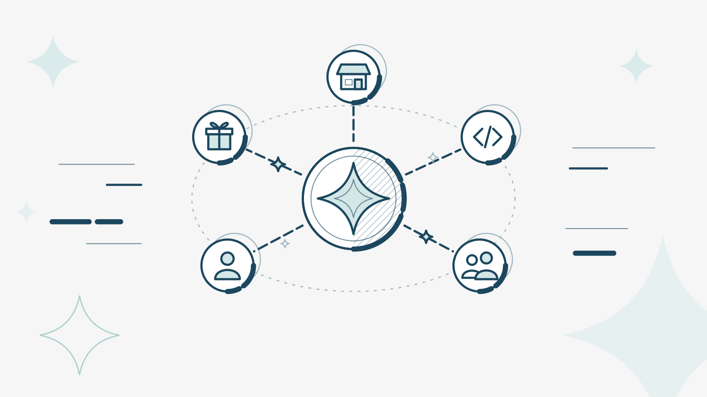
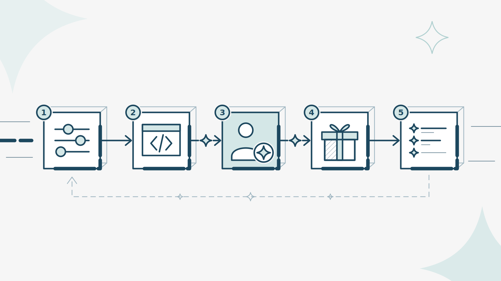

# Getting Started

## 1.0 > What is LoyaltyStars?

<figure><figcaption></figcaption></figure>

LoyaltyStars is the easiest way to launch and run a loyalty program. Configure earning and redemption for any product or service, in minutes, without writing a line of code. LoyaltyStars handles everything else: awarding stars instantly, tracking every balance and recording every transaction.

#### 1.1 > What you can do with it?

* **Reward the behavior that matters to you.** Set earning rules so members collect stars for the actions you care about.
* **Offer rewards worth coming back for.** Set redemption rules that define what stars can be exchanged for, and how members claim it.
* **Look after your members.** Find anyone in seconds, see their balance and history, and put things right when needed.
* **Connect it to your own platform.** Use the API so stars are awarded automatically, and SSO so members sign in with the account they already have.

#### 1.2 > Where you'll work?

Everything happens in the **Program Manager portal**. It's where you set up your program, manage your rules and help your members.

***

## 2.0 > Who is it for?

Join the LoyaltyStars ecosystem to give your customers rewards worth coming back for, and your brand a return you can dial up or down as you need. Run your own program, or team up with other brands so members earn and spend stars across all of you. We get loyalty. We've built programs for brands where every star has to count, and the results speak for themselves.

Whether you're the brand running the program, the developer connecting it, or the member collecting the stars, there's a place built for you.

<table data-view="cards"><thead><tr><th></th><th></th><th data-type="content-ref"></th><th data-hidden data-card-cover data-type="image">Cover image</th></tr></thead><tbody><tr><td><h4>For Brands</h4></td><td>Design, launch and run your loyalty program. Set what earns stars, what they're worth and which rewards are on offer, then watch your members grow.</td><td></td><td><a href="../.gitbook/assets/brands.png">brands.png</a></td></tr><tr><td><h4>For Developers</h4></td><td>Plug LoyaltyStars into your platform. Award stars automatically, sign members in with the account they already have and keep everything in sync.</td><td></td><td><a href="../.gitbook/assets/developers.png">developers.png</a></td></tr><tr><td><h4>For Members</h4></td><td>Earn stars for the things you already do, see your balance grow and redeem it for rewards you'll actually want.</td><td></td><td><a href="../.gitbook/assets/members.png">members.png</a></td></tr></tbody></table>

***

## 3.0 > How it works?&#x20;

<figure><figcaption></figcaption></figure>

Every loyalty program on LoyaltyStars follows the same loop. Once you know it, everything else in the platform will make sense.



### You set the rules

In the Program Manager portal, you create **earning rules** (what members are rewarded for, and how many stars they get) and **redemption rules** (what those stars can be exchanged for).



### Your platform tells us what happened

When a member does something on your platform, \[your system sends that activity to LoyaltyStars through the API]. You don't award stars by hand.



### Members earn stars

LoyaltyStars checks the activity against your earning rules and adds the right number of stars to the member's balance.



### Members redeem rewards

When a member has enough stars, they choose a reward. LoyaltyStars checks your redemption rules, takes the stars from their balance and sends the member to the right place to claim it.



### You see everything

Every star earned and spent is recorded. You can look up any member, see their full history and make adjustments if something needs correcting.




**Tip:** You can create and test your rules before your platform is connected. Setting up the program and connecting the API can happen side by side.


####
